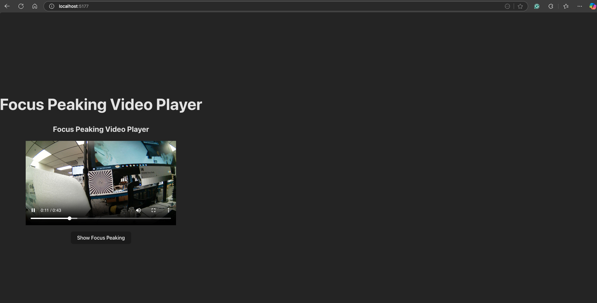

# Focus Peaking Video Player

A React-based application that demonstrates focus peaking on video content.

## Overview

Focus peaking is a camera feature that highlights areas of high contrast in an image, which usually corresponds to parts that are sharply in focus. This application:
- Loads and plays a provided sample video.
- Processes each video frame using OpenCV.js to detect edges (using Canny edge detection).
- Overlays a colored highlight (red) on these high-contrast areas to create the focus peaking effect.
- Provides a toggle button to switch the focus peaking overlay on and off.

## Features

- **Video Playback:** Plays a sample video stored in `public/video/exploreHD-Focus.mp4`.
- **Focus Peaking:** Uses OpenCV.js for edge detection and highlights edges in red.
- **Toggle Overlay:** A simple button lets you toggle the focus peaking effect.
- **Cross-Platform:** Designed to work locally on Ubuntu/Linux as well as other platforms.

## Technical Details

- **Frontend:** React.js (built with Vite for fast development)
- **Video Processing:** OpenCV.js (`@techstark/opencv-js`) to apply edge detection
- **Installation & Run Scripts:**
  - `install.sh`: Installs all necessary dependencies.
  - `run.sh`: Compiles and runs the application.
- **Environment Specifications:**
  - Node.js v20.10.0 or newer
  - Python 3.10 (if backend integration is needed, though this app currently runs fully in the browser)
  - Linux-compatible (x86), developed and tested on a Mac and Ubuntu.

## Getting Started

### Prerequisites

- Node.js (v20.10.0 or newer)
- npm

### Installation

1. **Clone the Repository:**
   ```bash
   git clone <YOUR_GITHUB_REPOSITORY_URL>
   cd focus-peaking-app


## Screenshots

### Focus Peaking Off (Original Video)



### Focus Peaking On (Edges Highlighted)
[Focus Peaking On](screenshots/Focus-Peaking-On.png)